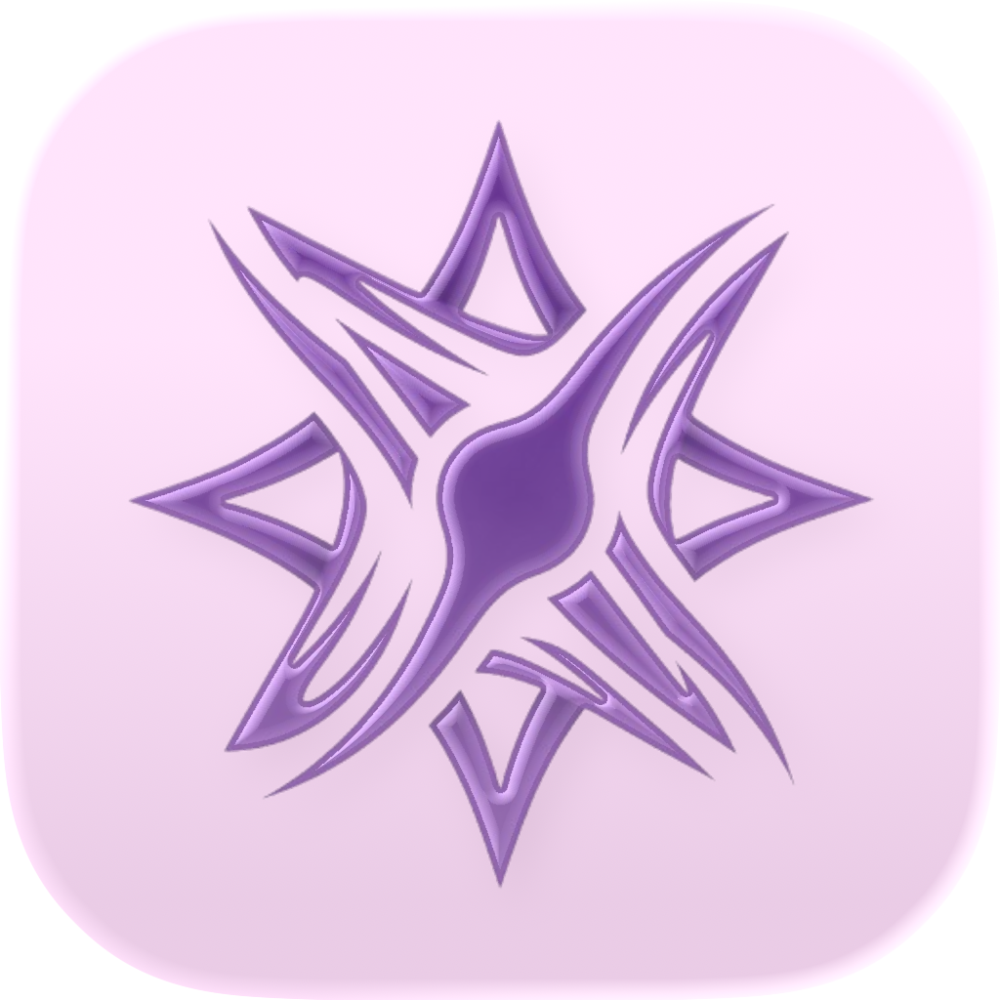

<table>
  <tr>
    <td width="200" valign="top">
      
    </td>
    <td valign="top">
      <h1>WorkautLM 🏋️‍♂️</h1>
      

        <strong>WorkautLM</strong> — это современное приложение для отслеживания тренировок на iOS, разработанное для тех, кто использует искусственный интеллект для составления программ тренировок. Оно ориентировано на удобство ввода данных, визуализацию прогресса и полную автоматизацию разбора планов.
      

    </td>
  </tr>
</table>

## О продукте

Главная идея проекта — избавиться от рутины при переносе программ из ИИ-ассистентов в телефон. Приложение берет на себя всю работу по структурированию данных, позволяя вам сосредоточиться исключительно на спортивных результатах, а затем помогает нейросети стать вашим полноценным фитнес-тренером благодаря обратной связи.

## Ключевые возможности

**Интеллектуальный импорт программ**
Забудьте о ручном вводе упражнений. Приложение умеет автоматически парсить текстовые ответы, сгенерированные в NotebookLM. Достаточно скопировать план тренировки от ИИ, и система мгновенно превратит его в готовую сессию с карточками упражнений, подходами и заданным диапазоном повторений.

**Полноценный трекер активности**
Нативный и минималистичный интерфейс для ведения журнала занятий прямо в зале. Отмечайте выполненные подходы, фиксируйте рабочие веса, отслеживайте прогрессию нагрузок и используйте встроенные таймеры отдыха. Для максимального удобства поддерживаются Live Activities и виджеты, чтобы пульс тренировки всегда был на экране блокировки.

**Двусторонняя синхронизация с ИИ**
Уникальная функция экспорта результатов. После завершения тренировки приложение формирует подробный отчет о проделанной работе (фактические веса, количество выполненных повторений, отклонения от плана). Вы можете легко выгрузить эти данные обратно в NotebookLM. Это позволяет искусственному интеллекту "видеть" ваш реальный прогресс, анализировать эффективность программы и вносить грамотные корректировки в следующие микроциклы.

## Идеальный Workflow

1. **Планирование:** Запросите у NotebookLM тренировочную программу под ваши текущие цели.
2. **Импорт:** Вставьте ответ ИИ в приложение — алгоритм распознает структуру и создаст тренировку.
3. **Выполнение:** Тренируйтесь, внося реальные показатели в удобный трекер.
4. **Анализ:** Экспортируйте результаты сессии обратно в NotebookLM для получения профессиональной аналитики и обновления плана.

## Технологии под капотом
Проект написан на современном стеке Apple:
- Полностью нативный интерфейс на Swift и SwiftUI.
- Использование WidgetKit для создания интерактивных виджетов и Live Activities.
- Надежная архитектура для быстрой обработки и парсинга текстовых данных.
